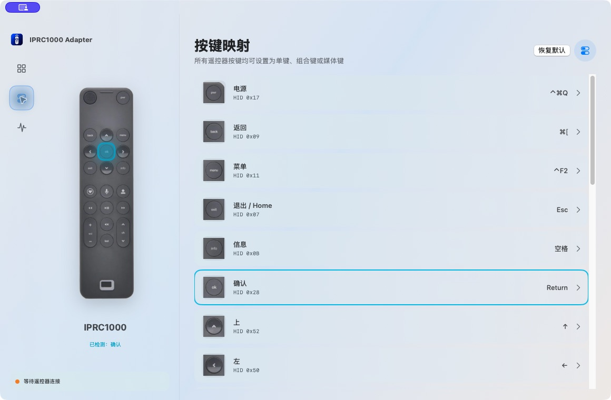
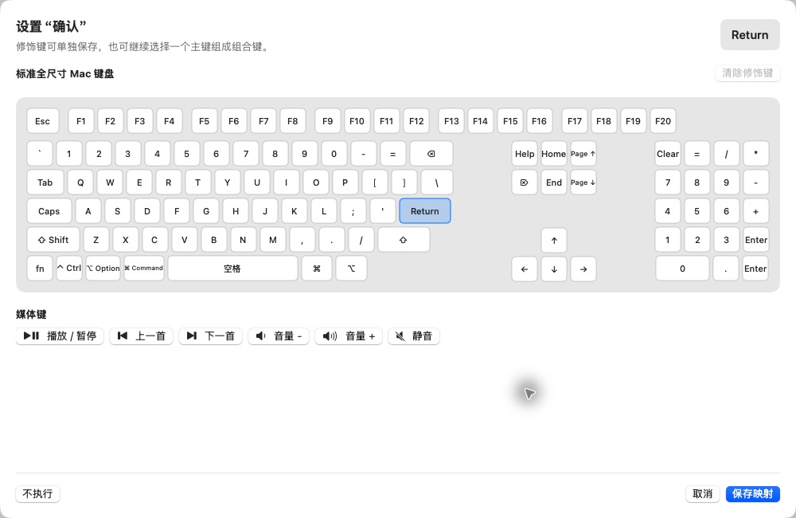

# IPRC1000 Adapter for macOS

IPRC1000 Adapter 是一款常驻 macOS 菜单栏的遥控器适配工具，面向产品名为
`IPRC1000`、VID/PID 为 `0A5C:8502` 的 Broadcom/Cypress 蓝牙遥控器。它可以拦截
遥控器原始键值，将每个按键重新映射为 Mac 单键、组合键或媒体键。

> 当前项目只匹配 `IPRC1000 + 0A5C:8502`。应用会监听全局键盘事件以过滤遥控器的
> 原始键值，但只有与目标遥控器 HID 报告的键码和时间戳匹配时才会拦截；其他输入设备
> 的普通事件会直接放行。

## 功能

- 精确匹配产品名、Vendor ID 和 Product ID，不保存遥控器 MAC、序列号或蓝牙 UUID。
- 将遥控器按键映射为任意 Mac 键盘单键、最多五种修饰键组合或系统媒体键。
- 支持只发送 `Control`、`Option`、`Shift`、`Command`、`Fn` 等修饰键。
- 过滤遥控器松键时错误产生的 `0x0C`（字母 `i`）报告。
- 提供连接状态、最近按键和按键通道诊断。

## 系统要求

- macOS 14 或更高版本。
- 一只产品名为 `IPRC1000`、VID/PID 为 `0A5C:8502` 的遥控器。
- 从源码构建需要 Apple Command Line Tools、Swift 6，以及项目当前固定使用的
  `MacOSX15.4.sdk`。

## 构建与运行

仓库已经包含预编译的 `Vendor/lib/libsbc.a`。一般情况下无需重新编译 libsbc：

```sh
git clone https://github.com/wangchll/IPRC1000.git
cd IPRC1000

SDKROOT=/Library/Developer/CommandLineTools/SDKs/MacOSX15.4.sdk \
CLANG_MODULE_CACHE_PATH=/private/tmp/iprc1000-module-cache \
SWIFT_MODULECACHE_PATH=/private/tmp/iprc1000-module-cache \
  swift build --disable-sandbox -c release \
    --sdk /Library/Developer/CommandLineTools/SDKs/MacOSX15.4.sdk
```

运行开发构建：

```sh
.build/arm64-apple-macosx/release/IPRC1000Adapter
```

生成 `.app`：

```sh
IPRC1000_CODE_SIGN_IDENTITY=- scripts/package-app.sh
open "dist/IPRC1000 Adapter.app"
```

`-` 表示本机 ad-hoc 签名。正式分发时，将 `IPRC1000_CODE_SIGN_IDENTITY` 替换为
Developer ID Application 签名身份。打包脚本会替换现有的
`dist/IPRC1000 Adapter.app`。

如果需要从源码重建 libsbc，再运行：

```sh
scripts/build-libsbc.sh
```

## 首次使用

1. 在 macOS 蓝牙设置中配对并连接 `IPRC1000` 遥控器。
2. 启动 IPRC1000 Adapter。关闭设置窗口不会退出应用，它仍会常驻菜单栏。
3. 根据界面提示授予“输入监控”和“辅助功能”权限：
   - 输入监控：读取目标遥控器 HID 报告。
   - 辅助功能：发送重新映射后的键盘和媒体键事件。
4. 返回应用总览，确认“设备连接”显示在线，然后按遥控器按键检查“当前操作”。
5. 如果修改权限后状态没有刷新，退出并重新启动应用。

## 自定义按键映射

打开左侧“按键映射”，可以查看所有遥控器按键及其当前动作。



修改一个按键：

1. 点击要修改的遥控器按键，例如“确认”或“返回”。
2. 在全尺寸 Mac 键盘中选择一个主键；再次点击已选主键可更换选择。
3. 如需组合键，先选择 `Control`、`Option`、`Shift`、`Command` 或 `Fn`，再选择主键。
4. 只选择修饰键、不选择主键，可以保存为单独的修饰键动作。
5. 也可以直接选择“播放/暂停”“上一首”“下一首”“音量”“静音”等媒体键。
6. 选择“不执行”可禁用该遥控器按键。
7. 点击“保存映射”立即生效；点击“取消”不会修改现有配置。



映射保存在当前 macOS 用户的应用偏好设置中。右上角“恢复默认”会重置所有按键，
因此使用前请确认不再需要现有自定义配置。

### 默认映射

| 遥控器按键 | 默认动作 | 遥控器按键 | 默认动作 |
| --- | --- | --- | --- |
| 电源 | `Control + Command + Q` | 返回 | `Command + [` |
| 菜单 | `Control + F2` | 退出 / Home | `Esc` |
| 信息 | `Space` | 确认 | `Return` |
| 上 / 下 | `↑` / `↓` | 左 / 右 | `←` / `→` |
| 爱心 | 不执行 | 功能键 `0x10` | 不执行 |
| 用户 | 不执行 | 未标记键 `0x16` | 不执行 |
| 播放 / 暂停 | 播放 / 暂停 | 快进 / 快退 | 下一首 / 上一首 |
| 频道 + / - | `Page Up` / `Page Down` | 音量 + / - | 系统音量 + / - |
| 静音 | 系统静音 | 上一个 | `Command + Tab` |

## 连接诊断

打开左侧“连接诊断”，可以检查按键通道和最近检测到的遥控器按键。

按键没有反应时依次检查：

1. macOS 蓝牙设置中是否已连接 `IPRC1000`。
2. App 总览是否识别到 `IPRC1000（0A5C:8502）`。
3. 系统设置 → 隐私与安全性中是否允许“输入监控”和“辅助功能”。
4. 运行内置自测，确认按键解析、型号隔离和事件过滤逻辑：

   ```sh
   .build/arm64-apple-macosx/release/IPRC1000Adapter --self-test
   ```

## 隔离范围说明

HID 设备订阅使用产品名、VID 和 PID 三重匹配。为了阻止目标遥控器原始键值继续进入
macOS，应用还会监听全局键盘事件，并通过键码和硬件时间戳与目标 HID 报告关联。正常情况
下其他键盘、鼠标和触控板不受影响；但 macOS 的 CGEvent 不直接携带物理设备句柄，因此
极端同时按键情况下仍存在很小的时间关联碰撞可能。详见源码中的
`HIDController.swift` 和 `RemoteEventFilter.swift`。

## License 与第三方代码

第三方 libsbc 的源码归档和许可证说明见 `Vendor/Source/sbc-2.2.tar.xz` 与 `NOTICE.md`。
